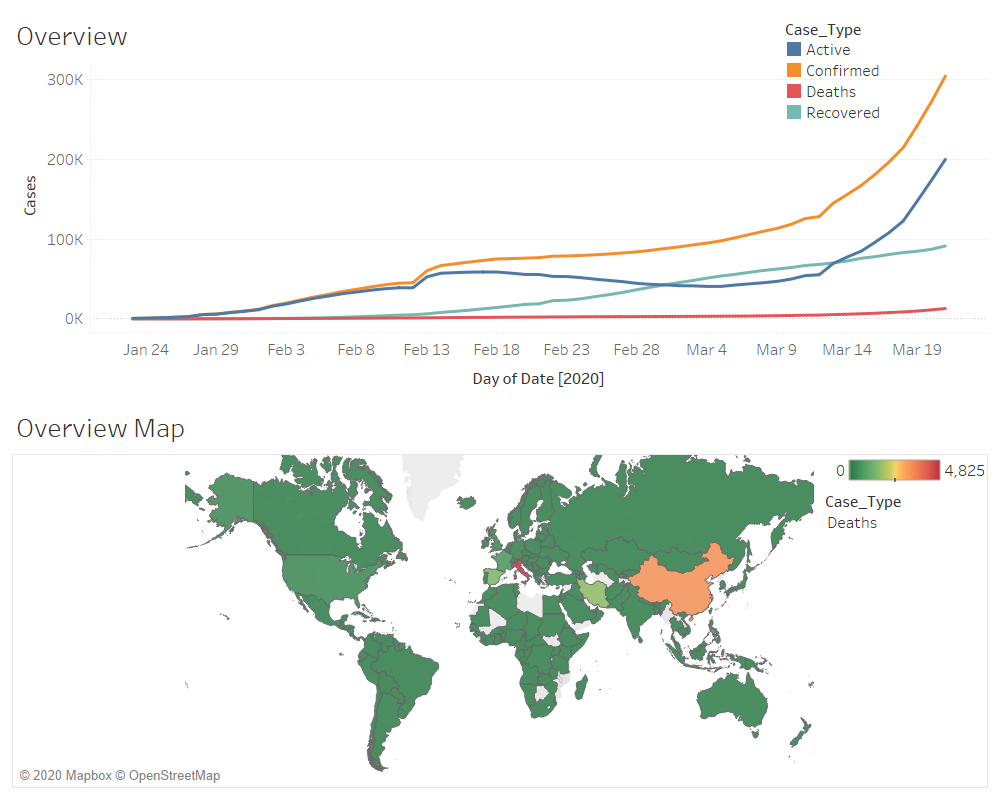
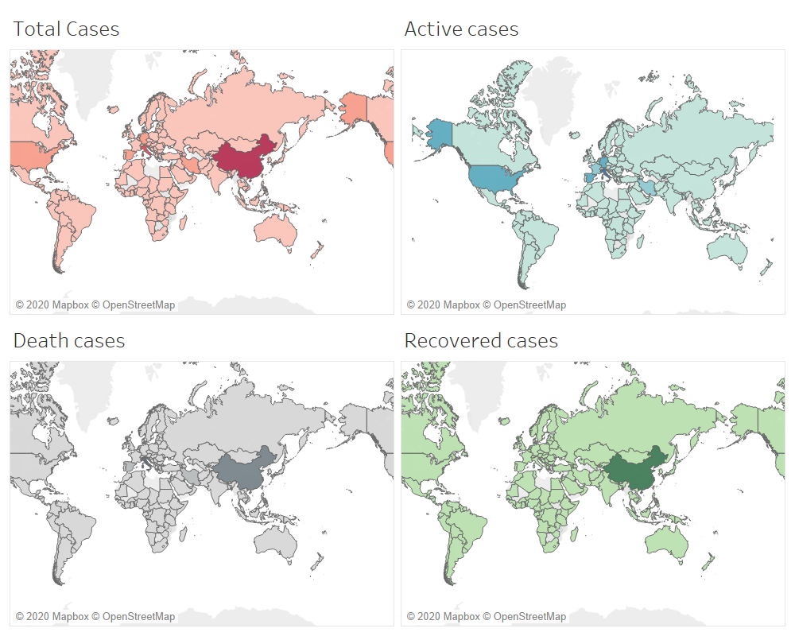

 #  Tableau Vizs. Based on COVID-19 Cases.csv

This project uses the COVID-19 Cases.csv as the source dataset to create dashboards and stories in tableau.

[abhijithremesh]/[Tableau-portfolio]//COVID-19 Cases/tableau viz/images/Overview.png
